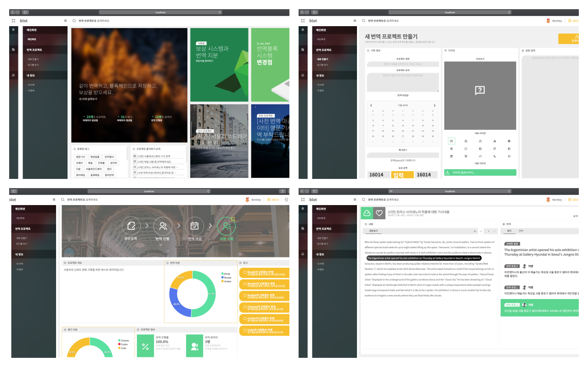
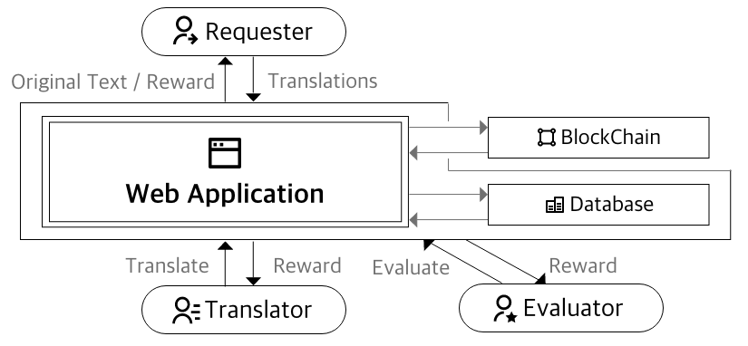
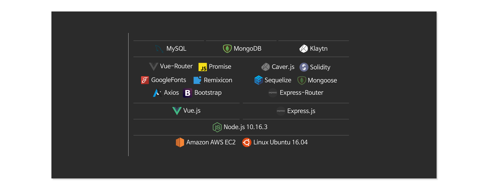

# Blot

[Demo Video](https://youtu.be/B-NZZfvat3w)

## 개요
Blot은 블록체인 기반 공동 번역 시스템입니다. 전문 지식이 필요한 논문이나 문맥이 복잡한 글에 대해 번역기가 아닌 사용자가 공동으로 번역을 작성하고 평가하여 더 좋은 품질의 번역 결과물을 도출하는 것을 목표로 합니다. 또한, 번역량과 번역 품질에 따른 사용자별 신뢰도를 블록체인 네트워크에 기록하여 신뢰성을 보장, 암호화폐(토큰) 보상을 제공합니다.

## 목차
- [구동 방법](#구동-방법)
- [핵심 기능](#핵심-기능)
- [기대 효과](#기대-효과)
- [차별화 : 블록체인](#차별화)
- [시스템 구성도](#시스템-구성도)
- [기술 스택](#기술-스택)
- [개발 관련 문서](#개발-관련-문서)
- [Credit](#Credit)

## 구동 방법
- FrontEnd
    > cd .../Server/frontend
    > npm run dev
- BackEnd
    > cd .../Server/backend
    > node app.js

## 핵심 기능
- 로그인 / 원문 등록
    - Key file과 암호키를 이용하여 Klaytn 계정 로그인.
    - 번역 요청자가 번역 프로젝트를 생성하고 원문을 입력하면 문장 단위로 Split.
- 번역 작성 / 평가 
    - 각 문장에 대해 모든 사용자가 각자 하나씩 번역을 작성할 수 있음.
    - 각 문장에 대해 모든 사용자가 가장 선호하는 번역을 선택(평가)할 수 있음.
- 마감 / 최종 번역 
    - 프로젝트가 마감되면 가장 많은 선택을 받은 번역이 최종 번역으로 선택됨.
    - 프로젝트가 마감되면 최종 선정된 번역자들은 번역량에 따라 지분을 나눠 가짐.
- 신뢰점수 / 보상 / 블록체인
    - 프로젝트가 마감되면 번역량과 평가활동에 따라 신뢰 점수를 변경하고 토큰 보상.
    - 신뢰 점수는 다음 번역과 평가 활동에 영향을 끼침 (가중치 적용).
    - 신뢰 점수의 변동 사항은 블록체인 네트워크에 저장됨.

## 기대 효과
- 번역 요청자
    > 전문 지식이 필요한 논문이나 문맥이 복잡한 글에 대한 번역 결과물 확보
- 번역자
    > 번역량과 번역 품질에 대한 합당한 대가(토큰)가 주어지며, 블록체인을 통해 저장한 신뢰 점수의 경우 위/변조가 어려운 특성상 자신의 번역 실력의 근거로 삼을 수 있음.  
- 시스템 운영
    > 사용자들의 번역활동으로 만들어지는 원문과 번역문은 빅데이터 처리에 용이한 MongoDB(NoSQL)를 통해 저장, 차후 머신러닝 등의 분야에 활용할 수 있음. 

## 차별화
- 블록체인
    - GroundX의 Klaytn을 활용하여 Scalability, Finality 문제 개선
    - 마감 등 Smart Contract 동작 시 서버에서 비용을 대납
    - ERC20 표준에 따라 자체 토큰(BLOT)설계
- UI/UX
    - 블록체인 로그인과 일반 회원 로그인을 분리하여 접근성 향상
    - 하나의 페이지에서 번역 평가 및 작성이 가능하도록 개발
    - 번역 마감 시 번역 결과를 모아 한눈에 볼 수 있음

## 시스템 구성도
- 전체 구성도

- 플로우 차트

## 기술 스택

## 개발 관련 문서
- [예시코드 및 API설계](./devNote.md)
- [테스트 계획](./testPlan.md)
- [블록체인 개발과정](./_BlockChain/BlockChainDevNote.md)
- [프레젠테이션 준비](./_BlockChain/presentation.md)
- [블록체인 개발 개요](./_BlockChain/readme.md)
- [백엔드 개발 개요](./Server/backend/backendNote.md)

## Credit
- 구본철
    - 팀장, 프론트엔드 개발
    - boncheolb@gmail.com
- 김승수
    - 블록체인, 백엔드 개발
    - nablekim94@gmail.com
- 남영우
    - 백엔드 개발
    - nywoo94@gmail.com

